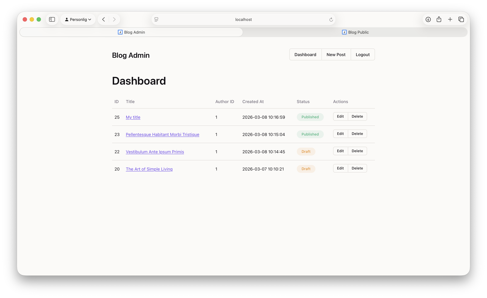
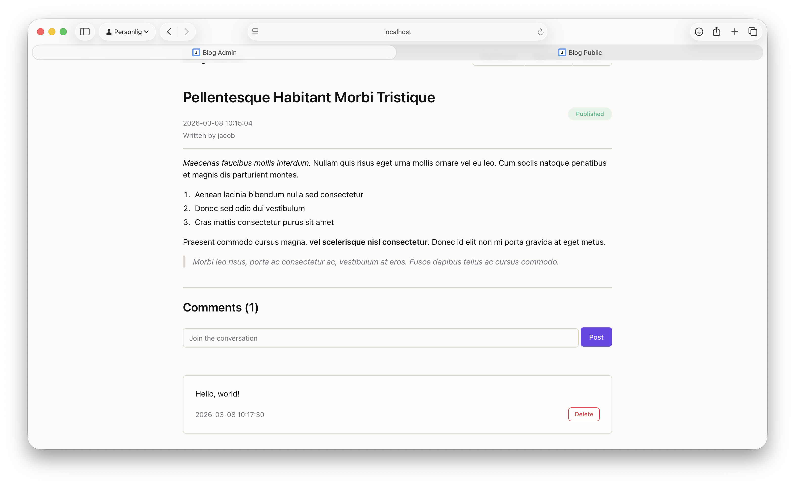
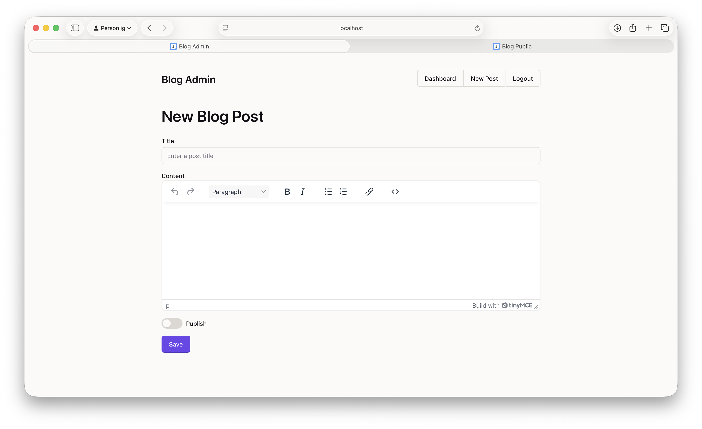
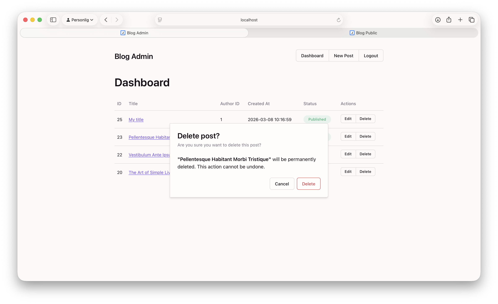
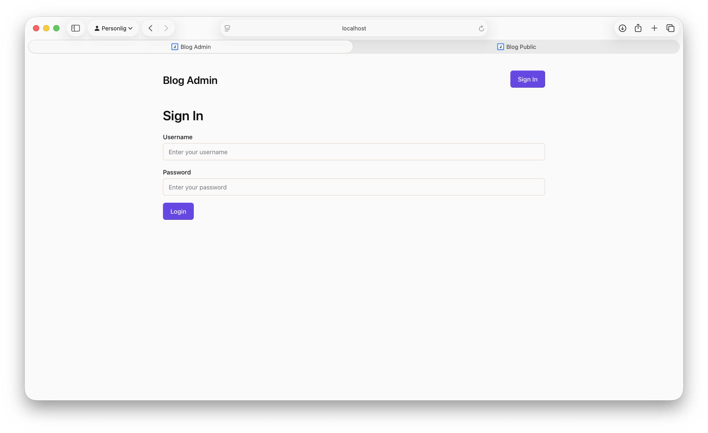

# Blog Admin

## Table of Contents

- [Project Overview](#project-overview)
- [Features](#features)
- [Tech Stack / Toolset](#tech-stack--toolset)
- [Screenshots](#screenshots)
- [Getting Started / Setup](#getting-started--setup)

## Project Overview

This repository contains the admin client for a three-part blog platform. The platform is built around a centralized Blog API (Node.js/Express with JWT authentication) and two frontend consumers: Blog Admin and Blog Public. Both frontends consume the same API, but each client exposes a different features and follows different access restrictions.

Related repositories:

- Public: [https://github.com/Jackan04/blog-public](https://github.com/Jackan04/blog-public)
- API: [https://github.com/Jackan04/blog-api](https://github.com/Jackan04/blog-api)
- Admin (Current): [https://github.com/Jackan04/blog-admin](https://github.com/Jackan04/blog-admin)

## Features

A protected interface for authenticated users who manage content. It supports signing in with JWT-based authentication, viewing all posts in a table, creating and updating posts with a rich text editor, toggling publish state, deleting posts, and moderating post comments from the post details view.

Compared to the public client, this app is focused on content operations rather than content consumption. It exposes write and moderation flows (create, update, delete, publish/unpublish, comment management) that are not part of the read-focused public app.

## Tech Stack / Toolset

- React
- React Router DOM
- Vite
- ESLint
- TinyMCE React integration (`@tinymce/tinymce-react`) for rich text authoring
- Oat CSS (`@knadh/oat`) for base UI styling/components
- date-fns for date formatting
- Fetch API for HTTP requests to the Blog API
- LocalStorage for storing JWTs on the client

## Screenshots











## Getting Started / Setup

### Prerequisites & Installation

From the project root:

```bash
npm install
```

### API Setup

API setup is documented in the [Blog API repository](https://github.com/Jackan04/blog-api?tab=readme-ov-file#:~:text=dotenv-,Getting%20Started%20/%20Setup,-Prerequisites):

After your API is running, this client expects it at `http://localhost:3000/api` (configured in `src/services/blogService.js`).

### Run Locally

Start the development server:

```bash
npm run dev
```
